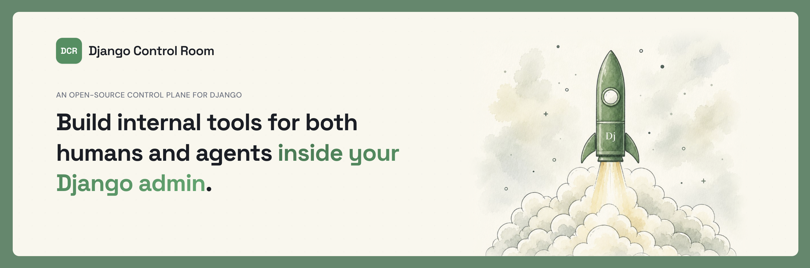

Django Control Room is an open-source framework for building operational software inside the Django admin. Create observability, debugging, monitoring, and management experiences through a flexible plugin architecture.

Build interfaces for both humans and AI agents. Every plugin can expose rich admin experiences alongside MCP tools, allowing developers and agents to inspect, understand, and operate Django applications using the same underlying APIs.

Also Enjoy a growing suite of existing plugins for tools like Redis, django caches, Celery, and others.
